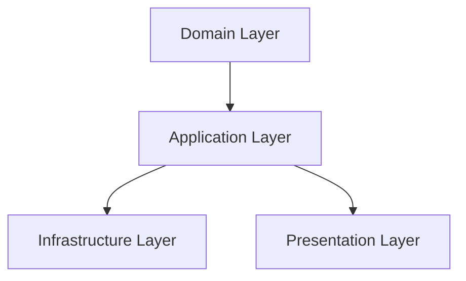

<div align="center">
  

  # ⏳ TimeBudget
  
  **Treat your time like money. Spend it intentionally.**

  [](https://opensource.org/licenses/MIT)
  [](https://www.typescriptlang.org/)
  [](https://reactjs.org/)
  [](https://nodejs.org/)
  [](https://www.prisma.io/)

  [Features](#-key-features) • [Tech Stack](#-tech-stack) • [Getting Started](#-getting-started) • [Architecture](#-architecture)
</div>

---

## 🚀 About TimeBudget

**TimeBudget** is a full-stack application that brings financial discipline to time management. Just as a zero-based budget gives every dollar a job, TimeBudget ensures every minute of your day serves a purpose. 

Stop wondering where your time went. Plan it, track it, and optimize it with the same rigor you apply to your finances.

## ✨ Key Features

### 🎯 Zero-Based Time Budgeting
Every minute gets a job. Allocate your 24 hours (1440 minutes) across categories before the day begins. If you overspend in one area, you must borrow from another.

### 🗑️ Radical Elimination
Identify "time leaks" and low-value activities. Our analytics highlight where you're bleeding time so you can ruthlessly eliminate distractions.

### 📊 Real-Time Analytics
- **Variance Analysis**: Compare Planned vs. Actual time in real-time.
- **Trend Tracking**: See how your focus shifts over weeks and months.
- **Category Breakdown**: Visualizations powered by Recharts.

### 🛡️ Clean Architecture
Built for scalability and maintainability, separating business logic from frameworks and drivers.

## 🛠️ Tech Stack

### Frontend
- **Framework**: React 18 + Vite
- **Language**: TypeScript
- **Styling**: TailwindCSS
- **State**: Zustand (with persistence)
- **Routing**: React Router
- **Charts**: Recharts
- **Icons**: Lucide React

### Backend
- **Runtime**: Node.js
- **Framework**: Express
- **Language**: TypeScript
- **Database**: PostgreSQL
- **ORM**: Prisma
- **Validation**: Zod
- **Testing**: Vitest

## 🏗️ Architecture

TimeBudget follows **Clean Architecture** principles to ensure long-term maintainability:



- **Domain**: Pure business entities and logic (No external dependencies).
- **Application**: Use cases and orchestration.
- **Infrastructure**: Database implementation, external services.
- **Presentation**: REST API controllers and routes.

## 🚀 Getting Started

### Prerequisites
- Node.js 18+
- Docker & Docker Compose

### Fast Track (Docker)

```bash
# 1. Clone the repo
git clone https://github.com/yourusername/timebudget.git
cd timebudget

# 2. Setup env
cp .env.example .env

# 3. Launch everything
docker-compose up -d

# 4. Visit http://localhost
```

### Local Development

#### Backend
```bash
cd backend
npm install
npm run db:generate  # Generate Prisma Client
npm run db:push      # Push schema to DB
npm run dev          # Start server
```

#### Frontend
```bash
cd frontend
npm install
npm run dev
```

## 🧪 Testing

We use **Vitest** for unit and integration testing.

```bash
# Backend Tests
cd backend
npm run test

# Frontend Tests
cd frontend
npm run test
```

## 📄 License

This project is licensed under the MIT License - see the [LICENSE](LICENSE) file for details.

---
<div align="center">
  <sub>Built with ❤️ by the TimeBudget Team</sub>
</div>
